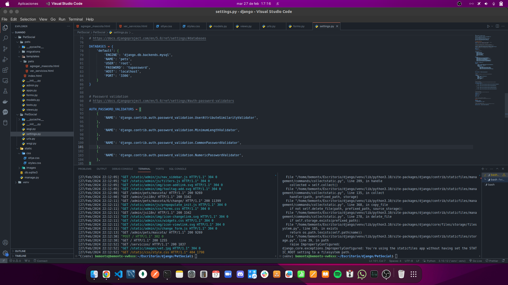

# PetSocial App
PetSocial es una plataforma en línea que permite a los usuarios registrar información sobre sus mascotas y acceder a una variedad de servicios relacionados con el cuidado de animales domésticos. La aplicación está diseñada para facilitar la gestión de datos de mascotas y ofrecer a los usuarios una experiencia fluida y amigable al interactuar con la plataforma.

## Características principales:
Registro de mascotas: Los usuarios pueden registrar fácilmente a sus mascotas proporcionando detalles como nombre, especie, raza y propietario.

Exploración de mascotas: Los usuarios pueden explorar una lista de mascotas registradas por otros usuarios, ver sus detalles y contactar con los propietarios.

Servicios para mascotas: PetSocial ofrece una variedad de servicios para el cuidado de mascotas, incluyendo baños, peluquería, paseos, guardería y más. Los usuarios pueden buscar y reservar estos servicios para sus mascotas.

Interacción social: Los usuarios pueden conectarse con otros amantes de las mascotas, compartir fotos y anécdotas de sus mascotas, y participar en discusiones relacionadas con el cuidado de los animales.

Administración de perfiles: Cada usuario tiene su propio perfil donde puede gestionar la información de sus mascotas, ver sus reservas de servicios y mantenerse al día con las últimas actualizaciones de la comunidad.

## Tecnologías utilizadas:
- Django: Framework de desarrollo web de Python que facilita la creación rápida y segura de aplicaciones web.
- HTML/CSS: Lenguajes de marcado y estilos para diseñar y dar formato a las páginas web.
- JavaScript: Lenguaje de programación para la interactividad en el navegador.
- Bootstrap: Framework de CSS para el diseño de páginas web responsivas y atractivas.
- SQLite/MySQL: Bases de datos utilizadas para almacenar la información de los usuarios, mascotas y servicios.
- Nginx: Servidor web para el despliegue del sitio en producción.
- Gunicorn: Servidor HTTP para la comunicación entre Nginx y la aplicación Django.

## Instalación y ejecución:

- Clona el repositorio desde GitHub: git clone https://github.com/tu-usuario/petsocial.git
- Instala las dependencias del proyecto: pip install -r requirements.txt
- Configura la base de datos en el archivo settings.py.
- Realiza las migraciones de la base de datos: python manage.py migrate
- Inicia el servidor de desarrollo: python manage.py runserver
- Accede a la aplicación en tu navegador: http://localhost:8000

¡Disfruta de PetSocial y cuida bien de tus mascotas!
